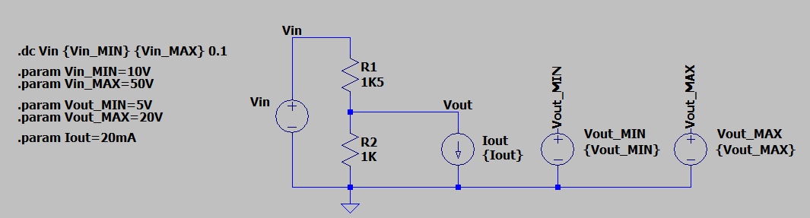
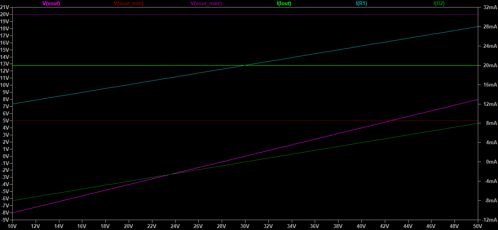
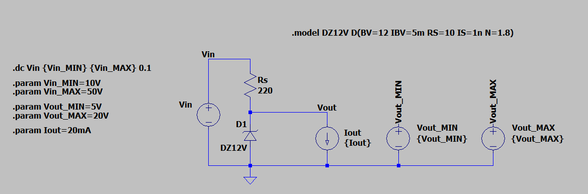
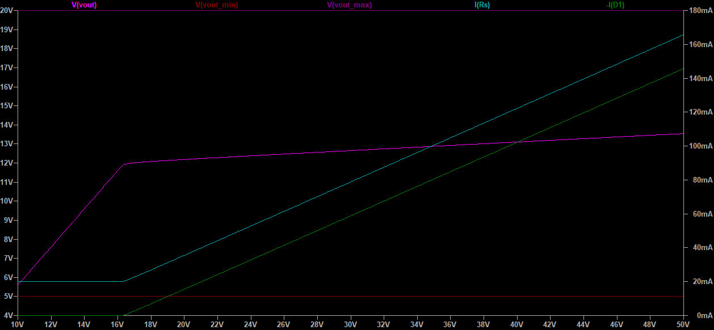
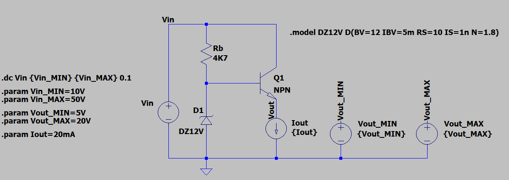
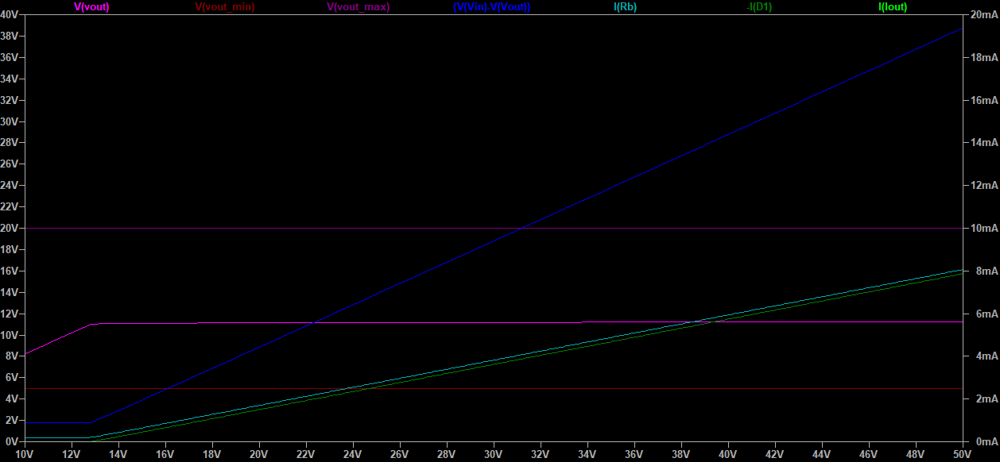

# Voltage reduction circuits
Part of the **[xp-circuit-blocks](..)** collection: practical notes about reusable circuit building blocks.

**Objective**:
Evaluate various circuit topologies designed to reduce a high supply voltage $V_{in}$, variable between $V_{in_{MIN}}$ and $V_{in_{MAX}}$, to a lower value between $V_{out_{MIN}}$ and $V_{out_{MAX}}$, in order to power a known fixed load (e.g., a linear regulator or a logic stage drawing a constant current $I_{out}$).

## Topology A: Resistive Voltage Divider
### Design:
Two resistors, $R_1$ and $R_2$, connected in series to divide the voltage based on their geometric ratio.

No-load condition (without connected load):
$$V_{out} = \frac{R_2}{R_1 + R_2} \times V_{in}$$

With load applied ($I_{out}$), the network can be modeled using its Thevenin equivalent circuit ($V_{th}, R_{th}$) at the output node:

$$V_{th} = \frac{R_2}{R_1 + R_2} \times V_{in}$$
$$R_{th} = R_1 \parallel R_2 = \frac{R_1 \times R_2}{R_1 + R_2}$$

The resulting loaded output voltage is:

$$V_{out} = V_{th} - (R_{th} \times I_{out}) = \left( \frac{R_2}{R_1 + R_2} \times V_{in} \right) - \left( \frac{R_1 \times R_2}{R_1 + R_2} \times I_{out} \right)$$

**Worst-Case Design Analysis**:
Even assuming a perfectly constant load current ($I_{out}$), a wide input voltage range ($V_{in} = V_{in_{MIN}} \div V_{in_{MAX}}$) prevents this topology from maintaining the output voltage within the target window $[V_{out_{MIN}}, V_{out_{MAX}}]$.

1. **At minimum input voltage ($V_{in_{MIN}}$):** 
   The load current pulls the output below the required minimum:

   $$V_{out(V_{in_{MIN}})} = \left( \frac{R_2}{R_1 + R_2} \times V_{in_{MIN}} \right) - \left( \frac{R_1 \times R_2}{R_1 + R_2} \times I_{out} \right) < V_{out_{MIN}}$$

2. **At maximum input voltage ($V_{in_{MAX}}$):** 
   The output scales linearly with the input and exceeds the required maximum:

   $$V_{out(V_{in_{MAX}})} = \left( \frac{R_2}{R_1 + R_2} \times V_{in_{MAX}} \right) - \left( \frac{R_1 \times R_2}{R_1 + R_2} \times I_{out} \right) > V_{out_{MAX}}$$

### Simulation:
The circuit was validated via LTspice using a DC Sweep ($V_{in} = 10\text{V} \div 50\text{V}$) with a constant current load $I_{out} = 20mA$ and a target window of $[5\text{V}, 20\text{V}]$.

At the beginning of the sweep the simulation plots a negative output voltage. This follows directly from the Thevenin model: when $R_{th} \times I_{out}$ exceeds $V_{th}$, $V_{out}$
drops below zero. In a real circuit the load would simply starve or shut down.

### Conclusions:
The plot shows that $V_{out}$ remains below $V_{out_{MIN}}$ for most of the input sweep, and crosses into the target window only at higher input voltages.
$V_{out}$ tracks both $V_{in}$ variations and load current changes. Any input swing between $V_{in_{MIN}}$ and $V_{in_{MAX}}$ inevitably drives the output outside the target boundaries $[V_{out_{MIN}}, V_{out_{MAX}}]$.

## Topology B: Zener Diode Shunt Regulator
### Design:
A series drop resistor $R_{S}$ combined with a Zener diode in parallel with the load, clamping the output voltage to the value $V_{out} = V_Z$, chosen such that $V_{out_{MIN}} \le V_Z \le V_{out_{MAX}}$.

**Circuit Analysis**:
$$V_Z = V_{out}$$
$$I_Z = I_R - I_{out} = \frac{V_{in} - V_Z}{R_S} - I_{out}$$

**Worst-Case Design Analysis**:
At minimum input voltage ($V_{in_{MIN}}$), the resistor $R_S$ must be sized small enough to supply both the load current and the minimum current required to keep the Zener active ($I_{Z_{MIN}}$):
$$R_S < \frac{V_{in_{MIN}} - V_Z}{I_{out} + I_{Z_{MIN}}}$$

At maximum input voltage ($V_{in_{MAX}}$), this fixed resistance drives a higher current $I_R$, which must be entirely absorbed by the Zener diode since the load current remains constant:
$$I_{Z(max)} = \frac{V_{in_{MAX}} - V_Z}{R_S} - I_{out}$$

This leads to severe thermal stress at $V_{in_{MAX}}$:
* **Resistor Dissipation:** $P_{R_{max}} = \frac{(V_{in_{MAX}} - V_Z)^2}{R_S}$
* **Zener Dissipation:** $P_{Z_{max}} = V_Z \times I_{Z(max)}$

### Simulation:
The circuit was validated via LTspice using a DC Sweep ($V_{in} = 10\text{V} \div 50\text{V}$) with a fixed target window $[V_{out_{MIN}}, V_{out_{MAX}}] = [5\text{V}, 20\text{V}]$ and a $12\text{V}$ Zener diode, which sits ideally at the center of the target range. The load is modeled as a constant current load $I_{out} = 20\text{mA}$. 
To guarantee that the output remains above $V_{out_{MIN}}$ even at the lowest input voltage, the series resistor $R_S$ was dimensioned at $220\,\Omega$.

The simulation plot distinguishes two operational zones:

1. **Unregulated Zone ($V_{in} < 16.4\text{V}$):** The input voltage is too low to drive the Zener into reverse breakdown. The load current flows through $R_S$, causing a fixed voltage drop of $\Delta V = 220\,\Omega \times 20\text{mA} = 4.4\text{V}$. The output tracks the input linearly ($V_{out} = V_{in} - 4.4\text{V}$) meeting the minimum target constraint at $V_{in_{MIN}}$.

2. **Regulated Zone ($V_{in} \ge 16.4\text{V}$):** The voltage across the load reaches $12\text{V}$, forcing the Zener into breakdown. The output voltage remains clamped at $12\text{V}$ throughout the rest of the sweep.

### Conclusions:
The output is locked to $V_Z$, keeping it within $[V_{out_{MIN}}, V_{out_{MAX}}]$. However, as $V_{in}$ rises the total input current increases. Since the load draws a fixed current, the Zener diode is forced to shunt the entire excess current. 
Sizing the circuit to prevent load starvation at $V_{in_{MIN}}$ may trigger a thermal overstress scenario at $V_{in_{MAX}}$, forcing the passive and shunt components to handle massive thermal dissipation.

## Topology C: Series Regulator (Emitter Follower with Zener)
### Design:
An NPN transistor acts as a series pass element (Pass Transistor). Its base is held to the reference voltage $V_{Z}$ through a bias resistor $R_{B}$, with the load connected at the emitter.

**Circuit Analysis**:
$$V_Z = V_{out} + V_{BE}$$
$$I_E \approx I_{out}$$
$$I_Z = I_R - I_{B} \approx \frac{V_{in} - V_Z}{R_B} - \frac{I_{out}}{h_{FE}}$$

**Worst-Case Design Analysis**:
Over a wide input range ($V_{in} = V_{in_{MIN}} \div V_{in_{MAX}}$), the design must simultaneously ensure the base is driven hard enough at low input voltage, and that thermal limits are respected at high input voltage. A conservative minimum transistor gain $h_{FE(min)}$ must be assumed throughout.

1. **Constraint at minimum input voltage ($V_{in_{MIN}}$) - Zener off scenario:**
   The base must stay above $V_{out_{MIN}} + V_{BE}$ to keep $V_{out}$ above its minimal threshold. The maximum allowable voltage drop across the base resistor $R_B$ is:
   $$\Delta V_{max} = V_{in_{MIN}} - (V_{out_{MIN}} + V_{BE})$$

   The worst-case base current is determined by the minimum transistor gain:
   $$I_{B(max)} = \frac{I_{out}}{h_{FE(min)}}$$

   This sets an upper limit on the bias resistor:
   $$R_B < \frac{\Delta V_{max}}{I_{B(max)}} \implies R_B < \frac{V_{in_{MIN}} - V_{out_{MIN}} - V_{BE}}{\frac{I_{out}}{h_{FE(min)}}}$$

   *A higher $R_B$ starves the base at low input voltages, pulling $V_{out}$ below the minimum threshold.*

2. **Power dissipation analysis at maximum input voltage ($V_{in_{MAX}}$) - Zener on scenario:**
   With $R_B$ fixed below its upper limit, the Zener enters strong conduction as $V_{in}$ rises, clamping the base voltage $V_Z$ and keeping $V_{out}$ below $V_{out_{MAX}}$. The reference branch current increases and splits between the Zener and the transistor base:
   $$I_R = \frac{V_{in_{MAX}} - V_Z}{R_B}$$

   Component dissipations are:
   * **Bias Resistor:** $P_{R} = (V_{in_{MAX}} - V_Z) \times I_R = \frac{(V_{in_{MAX}} - V_Z)^2}{R_B}$
   * **Zener Diode:** $P_Z = V_Z \times I_Z = V_Z \times (I_R - I_B)$
   * **Pass Transistor:** $P_{D(Q)} = (V_{in_{MAX}} - V_{out}) \times I_{out}$

### Simulation:
The circuit was validated via LTspice using a DC Sweep ($V_{in} = 10\text{V} \div 50\text{V}$) with a target window $[V_{out_{MIN}}, V_{out_{MAX}}] = [5\text{V}, 20\text{V}]$, using a a $12\text{V}$ Zener diode as the transistor base voltage reference. The load is modeled as a constant current load $I_{out} = 20\text{mA}$. To guarantee proper base drive at $V_{in_{MIN}} = 10\text{V}$, the bias resistor $R_b$ was dimensioned at $4.7\text{ k}\Omega$.

The simulation plot distinguishes two operational zones:

1. **Unregulated Zone ($V_{in} < 13\text{V}$):** The input voltage is lower than the Zener breakdown threshold, leaving the diode inactive. However, the bias resistor supplies sufficient current to the transistor base. The output voltage settles within the target window, while successfully delivering the full $20\text{mA}$ required by the constant current load.

2. **Regulated Zone ($V_{in} \ge 13\text{V}$):** As the input voltage crosses $\approx 13\text{V}$, the Zener diode enters reverse breakdown and clamps the base to $12\text{V}$. The emitter follower architecture tracks this reference, stabilizing $V_{out}$ at $V_Z - V_{BE}$ up to the absolute maximum input.

### Conclusions:
The load current flows directly from $V_{in}$ through the transistor collector. Only the small base current $I_B$ flows through $R_{B}$ and the Zener, reducing the power stress on the reference diode compared to Topology B. 
However, pushing the input range higher while maintaining a minimum output voltage at low input forces a larger bias current $I_R$ at $V_{in_{MAX}}$. Thermal stress shifts onto $R_B$ and the pass transistor, both of which require careful sizing.

## Notes
* **On Op-Amp based alternative:** 
*"An op-amp regulator is a natural evolution of Topology C, replacing the passive Zener reference with an error amplifier. However, it requires a supply voltage within the op-amp's rated* $V_{CC_{max}}$​. *When* $V_{in_{MAX}}$ *exceeds this limit, one of the topologies above would be needed just to power the op-amp itself: a circular dependency. Within that constraint, it remains a valid and superior alternative."*

## About & License
**Author**: Alessandro Fraschetti (gom9000). 
**License**: This experience is licensed under the [MIT License](LICENSE). The license applies to all the documentation, schematic files, and PCB layouts provided in this repository.